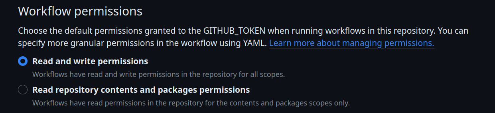

# Github-Release-Action

[](https://github.com/elgohr/Github-Release-Action/actions)

Creates a plain Github release, without attaching assets or source code.

## Usage

```yaml
name: Publish Release
on:
  push:
    tags:
      - 'v*'
jobs:
  build:
    runs-on: ubuntu-latest
    steps:
    - uses: actions/checkout@v3
    - name: Create a Release
      uses: elgohr/Github-Release-Action@v5
      env:
        GH_TOKEN: ${{ secrets.GITHUB_TOKEN }}
      with:
        title: MyReleaseMessage
        tag: MyTag
```

## Mandatory Arguments

### title
`title` is a message which should appear in the release. May contain spaces.

## Optional Arguments

### workdir
`workdir` can be used to specify a directory that contains the repository to be published. 

### tag
`tag` can be used to set the tag of the release

## Notes

`${{ secrets.GITHUB_TOKEN }}` can be used for publishing, if you configure the correct permissions.

This can be done by giving the Github token _all_ permissions (referred to as "Read and write permission") with the setting below available in Settings > Actions > General  

OR alternatively it can be achieved via adding

```yaml
permissions:
  packages: write
  contents: write
```

to the concrete job creating the release. For more details see the [documentation on token permissions.](https://docs.github.com/en/actions/security-guides/automatic-token-authentication#modifying-the-permissions-for-the-github_token)